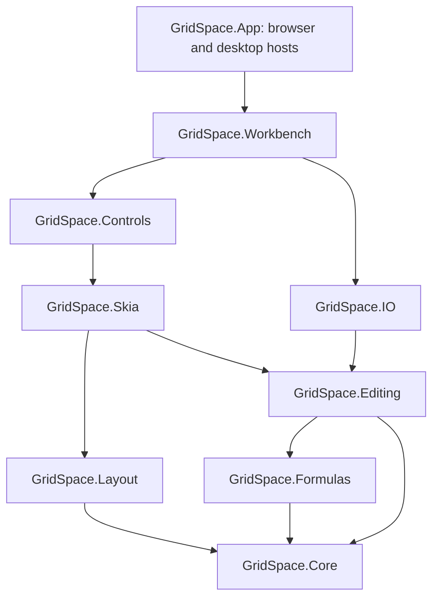

# Architecture

## Dependency direction

Core, Formulas, Editing, IO, Layout and Skia have no Uno dependency. Controls and Workbench are Uno libraries with browser and desktop target frameworks. App owns startup, file pickers, downloads and local recovery storage. There is no alternate JavaScript workbook engine.

## Model and transactions

Worksheets store populated cells in an address-keyed dictionary; row heights, column widths and hidden indexes are sparse metadata. Cell values and styles are immutable records, while workbook and worksheet containers are mutable and single-owner.

`SpreadsheetSession.Perform` is the transaction boundary. It records native JSON before and after an edit, rolls back on failure, and exposes bounded undo/redo. Nested operations join the outer transaction. History is capped at 40 entries and approximately 32 MB of UTF-16 character accounting. Snapshot history is intentionally simple and deterministic; it is not a structural-sharing persistent model and incurs O(document-size) work per transaction.

Document consumers subscribe to `Changed`. Restoration replaces the workbook and calculator; consumers must use `session.Book` and `session.Sheet` rather than retaining stale worksheet instances after undo, redo or load. The session is not thread-safe. Background work should operate on a serialized snapshot and return an explicit result to the model's owning thread.

## Calculation

The parser constructs an expression tree. The evaluator caches parsed formulas and calculated cells, invalidating results on workbook revision changes. It tracks active evaluation paths to detect cycles and bounds depth, range size and evaluation work. It does not use a dependency DAG or incremental topological recomputation yet.

Relative/absolute reference translation is shared by fill, clipboard operations, sorting and structural insertion. Workbook-defined names and quoted sheet names are resolved through the model. Host code can register trusted extension functions; workbook text cannot load assemblies, run JavaScript or issue network requests through the default evaluator.

## Geometry

`AxisLayout` stores sorted non-default indexes plus cumulative size deltas. Position lookup uses binary search. Offset-to-index lookup uses a monotonic upper-bound search that skips runs of zero-size hidden rows or columns. It does not allocate a row object for every Excel coordinate.

`GridViewport` works in device-independent pixels. Scrolling is stored in unscaled sheet units. Frozen rows/columns form up to four independently clipped panes. The same geometry supplies renderer positions, input hit-testing, editor placement, scrollbar ranges and ensure-visible navigation. Row/column headings remain unscaled UI chrome.

## Rendering and resources

`SpreadsheetRenderer` draws visible cell rectangles, intersecting merges, range selection, charts and headings. Chart previews are bounded. Typeface registration and native fallback lookup are isolated in `TypefaceCatalog`: registered families are retained independently from the bounded fallback cache. Paints, fonts and native handles have explicit ownership and disposal.

The application downloads content-pinned Carlito faces during the build and gives the font bytes to the renderer. Uno receives the same application font resource. Workbook font-family metadata is preserved; Arial/Calibri/Aptos requests use the application's declared fallback where those proprietary fonts are not supplied.

The alpha renderer clips cell text and supports basic wrapping; it does not yet implement Excel's empty-neighbour overflow, complex-script shaping, rich text runs, all border styles, conditional-format rules or multi-series chart layout.

## Controls and hosting

The grid is an Uno `UserControl` containing an `SKCanvasElement`, an overlay editor and custom scrollbars. Pointer gestures do not mutate row/column sizes until release. Fill and edit commits use the session. A native Uno TextBox is used while editing to retain platform text input services.

The custom Office button has its own template and focus states. Ribbon descriptions are data-driven, and command IDs are dispatched by the workbench. Formula bar, tabs, status bar and ribbon can be hosted separately. Dialogs use Uno ContentDialog and standard text-input primitives; they are not independent OS windows.

`IWorkbookStorage` separates file and recovery policy from UI. Browser storage uses IndexedDB and explicit download/file-input gestures. Desktop recovery replaces a temporary file atomically. Recovery is a single local slot, not versioned cloud storage. The workbench serializes writes and reschedules when edits arrive during an outstanding write.

## Browser testing

`?test=1` enables read-only diagnostic state and disables persistent recovery access so public-site acceptance does not overwrite user documents. Tests still enter data through actual Uno keyboard/pointer input. No document-mutation bridge is exposed. The published `build-info.json` identifies the exact source commit; deployment validates that marker before running public-site tests.
