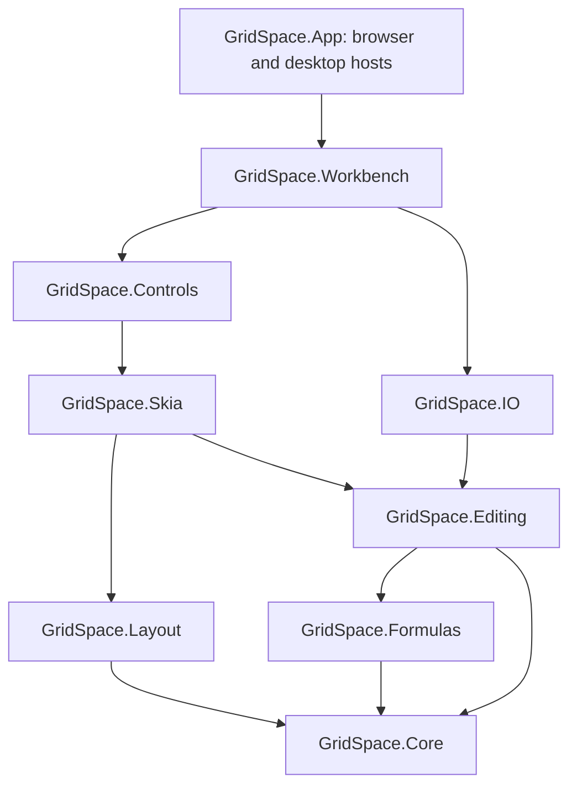

# Architecture

## Dependency direction

The first six libraries are independent of Uno. Controls and Workbench target Uno browser/desktop. App owns startup, file pickers/downloads and local recovery storage. There is no alternate JavaScript workbook engine. Open XML SDK is a test-only validator dependency; the runtime IO implementation remains independent of it.

## Model and transaction ownership

Worksheets store populated cells in address-keyed dictionaries. Axis sizes, hidden indexes and data-tool definitions are sparse metadata. Cells/styles/rule/filter/sort definitions are records; workbook and worksheet containers are mutable and single-owner.

Cell-oriented commands use `ApplyCells`: all changes are prepared and validated before mutation, and undo retains immutable before/after cells instead of serializing the entire workbook. `SpreadsheetSession.Perform` remains the snapshot boundary for structural and general metadata commands, rolls back failures and joins nested operations. History retains at most 40 entries with an approximate 32 MB accounting threshold; one oversized entry may remain. Snapshot commands still cost O(document size).

Cell-delta undo/redo preserves workbook, worksheet and calculator identity. Restoring a structural snapshot or loading replaces them. Consumers must read `session.Book` and `session.Sheet`, not retain obsolete worksheet instances across structural history. A live session is not thread-safe. Background calculations should operate on a snapshot and marshal results to the owning UI thread.

## Structural transforms

`AxisEdit` is the shared bounded insertion/deletion primitive. It maps an index, cell or complete rectangular interval. Partially deleted intervals contract; fully deleted intervals disappear. Insertions reject out-of-bounds stored data or range metadata instead of discarding it.

`FormulaReferences` recognizes A1 references and full ranges, propagates the first sheet qualifier to an unqualified second endpoint, preserves absolute/mixed markers and skips quoted string literals. The structural session operation applies the same axis transform to cells, sizes, merges, names, filter/sort ranges, validation, charts and conditional-rule regions. It rebases the rule formula before a removed top-left rule anchor is replaced with its first surviving cell. The complete operation is one transaction.

Deleting a worksheet rewrites supported references immediately to `#REF!`, preventing an unrelated sheet with a recycled name from resurrecting old references. The transform does not claim support for grammar the formula engine cannot represent, such as external workbook references, 3D ranges or arbitrary shifted-cell operations.

## Calculation and conditional formatting

The parser builds scalar and rectangular-array expression trees. A bounded 8,192-entry mutation journal distinguishes cell input changes from style-only changes. Direct/reverse dependency sets invalidate the transitive users of edited scalar inputs while retaining independent values. Structural mutations, journal eviction or dependency-budget overflow fall back to full invalidation. Parsed formulas and non-empty cell values are bounded; active evaluation paths detect cycles. This is single-owner demand-driven evaluation, not a parallel calculation scheduler.

Spill ownership is derived state. Only anchors store expressions; followers refer to a bounded virtual result map. Input mutations conservatively reconcile potential spill anchors and invalidate consumers of their previous output. Scalar dependencies remain incremental, but array ranges are not updated element-by-element.

`ConditionalFormattingEngine` consumes the calculator and returns an effective style plus an optional data-bar visual. It never mutates base styles. Rules are priority ordered; nullable differential properties compose independently with first-set-wins precedence. Matching Stop If True rules terminate boolean-rule evaluation. Statistical ranges, numeric distributions and typed value frequencies are cached by workbook revision. Relative rule expressions are translated from the range's top-left anchor to the queried cell.

Color scales interpolate supported min/median/max endpoints. Signed bars return normalized axis/start/end coordinates and a color; Skia rendering turns these pure values into clipped rectangles before drawing text. The same effective style controls AutoFit text measurements.

## Filtering and sorting

`WorksheetFilterEngine` compiles value sets or up to two custom predicates per column. Columns combine with And. Glob-like text expressions are escaped into a nonbacktracking regular expression with bounded execution. Numeric relational filters compare numeric values; explicit value lists use invariant calculated strings.

`Worksheet.HiddenRows` is manual visibility. `FilteredRows` is the independently evaluated filter exclusion set. Geometry uses their union. Clearing a filter only changes the exclusion set. Editing data does not automatically rerun the filter: the explicit Reapply command does; sort and structural edits reapply within their transactions.

Multi-level sorting snapshots key values and cell records before writing. Type order, direction, blank-last behavior and original row as the final tie-breaker produce stable deterministic results. Row-relative formulas translate after movement. Merged ranges and over-budget operations are rejected before mutation.

## Geometry and rendering

`AxisLayout` stores sorted non-default indexes plus cumulative size deltas. Position lookup uses binary search; offset-to-index uses a monotonic upper-bound search and skips long runs of zero-sized hidden rows. There is no object for every sheet coordinate.

`GridViewport` uses device-independent pixels and unscaled sheet scroll offsets. Frozen rows/columns produce up to four independently clipped panes. Rendering, hit-testing, editor placement, scrollbars and ensure-visible navigation share the same geometry. Headings remain unscaled UI chrome.

`SpreadsheetRenderer` draws visible cells, intersecting merges, selections, conditional visuals, bounded charts and headings. `TypefaceCatalog` owns registered families independently from its bounded native fallback cache. Native resources have explicit disposal. The application supplies content-verified Carlito faces to Uno and Skia; logical workbook font-family metadata is retained.

Remaining rendering gaps include empty-neighbour text overflow, full complex-script shaping, rich text, every border/chart variant and exact Excel pixel metrics.

## Controls and host integration

The grid combines `SKCanvasElement`, an overlay text editor and custom scrollbars. Pointer resize previews do not commit until release. The native Uno TextBox used during editing retains platform text-input services.

Library-owned Office buttons have templates/focus states; ribbon tabs/groups/commands are data-driven. `FilterEditorControl`, `SortEditorControl` and `ConditionalFormatEditorControl` are reusable compound editors. Workbench composes them into header flyouts, dialogs and a rules manager. Keyboard accelerators and canvas filter-button hit-testing route through the same session commands. Some input/dialog primitives remain Uno controls rather than bespoke low-level replacements.

`IWorkbookStorage` isolates platform IO. Browser recovery uses IndexedDB; desktop recovery replaces a temporary file atomically. Workbench serializes recovery writes and schedules another write when edits arrive during one already in progress. Recovery remains a single local slot.

## Interchange and validation

The XLSX reader/writer handles its explicit OOXML subset with bounded ZIP/XML processing. Standard differential styles, conditional rules, filter columns and sort state are serialized in worksheet schema order. Unsupported variants produce import notes. An optional GridSpace extension retains details that standard row-hidden state cannot disambiguate; arbitrary foreign extensions are not preserved.

Engine tests include semantic invariants, seeded transform regressions and pixel assertions. Independent Open XML SDK schema validation catches format errors that self-roundtrips alone could miss. Browser tests perform physical UI input using opt-in read-only state and geometry snapshots. `?test=1` disables recovery access and exposes no mutation bridge. Production startup never attaches the diagnostics timer.

Deployment requires a successful main build, verifies `build-info.json` provenance and repeats the physical-input browser suite against the public Pages URL. Native CI builds all three desktop platforms, but does not replace manual testing of native pickers, IME, accessibility or physical touch hardware.

## 0.3 ownership and performance

See [arrays and performance](arrays-performance.md) for the mutation journal, delta history, virtual spill map, cache bounds, geometry reuse and measured baseline comparison. Direct container mutation still requires `Workbook.Touch()` or `Attach()`; single-owner sessions are not thread-safe.
